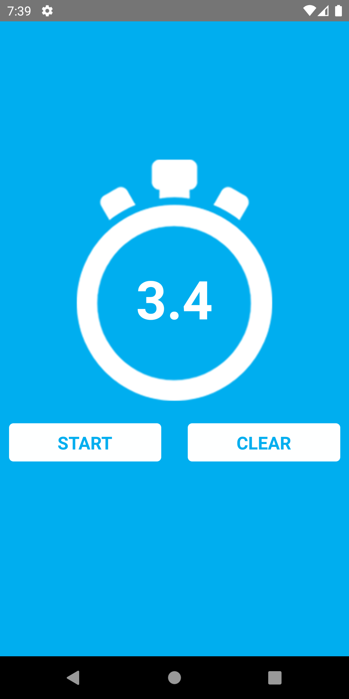
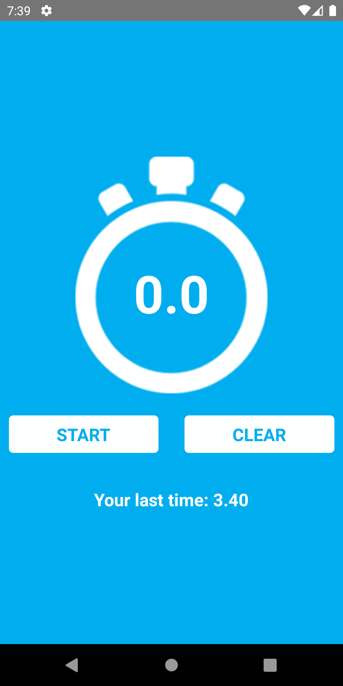

<h1 align=center>Stopwatch</h1>

## 🚀 Description

<p>This is a simple stopwatch project</p>
<p>The main functions are:</p>
<p>✔️ Timing the time;</p>
<p>✔️ Stop the stopwatch;</p>
<p>✔️ Clearing the stopwatch;</p>
<p>✔️ Saving the last time.  </p>

### 🎨 Final Design

<div align=center>
 
 
 
</div>

# Getting Started

> **Note**: Make sure you have completed the [Set Up Your Environment](https://reactnative.dev/docs/set-up-your-environment) guide before proceeding.

## Step 1: Start Metro

First, you will need to run **Metro**, the JavaScript build tool for React Native.

To start the Metro dev server, run the following command from the root of your React Native project:

```sh
# Using npm
npm start

# OR using Yarn
yarn start
```

## Step 2: Build and run your app

With Metro running, open a new terminal window/pane from the root of your React Native project, and use one of the following commands to build and run your Android or iOS app:

### Android

```sh
# Using npm
npm run android

# OR using Yarn
yarn android
```

### iOS

For iOS, remember to install CocoaPods dependencies (this only needs to be run on first clone or after updating native deps).

The first time you create a new project, run the Ruby bundler to install CocoaPods itself:

```sh
bundle install
```

Then, and every time you update your native dependencies, run:

```sh
bundle exec pod install
```

For more information, please visit [CocoaPods Getting Started guide](https://guides.cocoapods.org/using/getting-started.html).

```sh
# Using npm
npm run ios

# OR using Yarn
yarn ios
```

If everything is set up correctly, you should see your new app running in the Android Emulator, iOS Simulator, or your connected device.

This is one way to run your app — you can also build it directly from Android Studio or Xcode.

## 📞 Contact

- Author - <a href="https://wa.me/+5532984179500">Andrei Hoffmann Ferreira</a>
- Linkedin - [https://www.linkedin.com/in/devhoffmannferreira/](https://www.linkedin.com/in/devhoffmannferreira/)